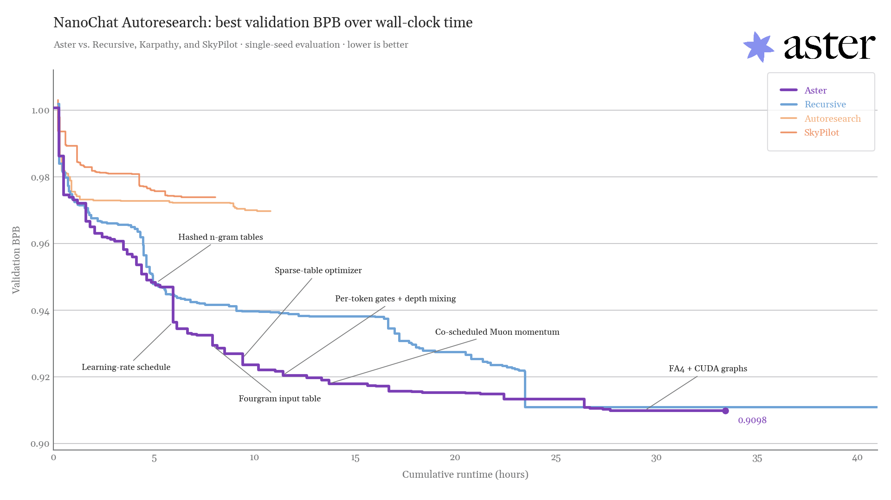
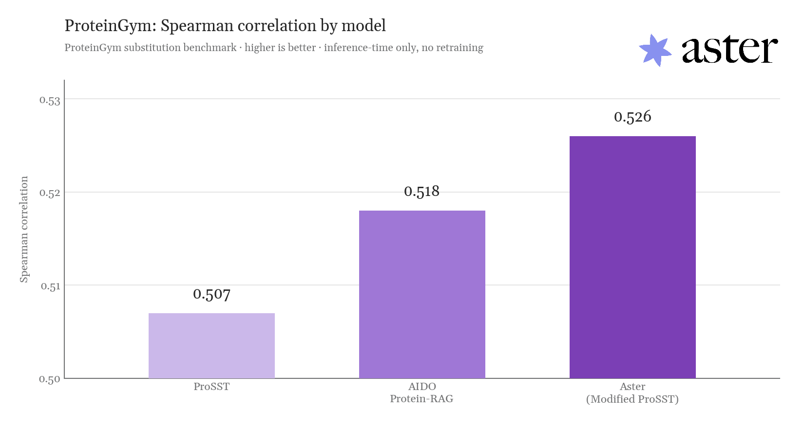

# Announcing Strong Results from Aster's Autonomous Research System

Open-source results discovered by our autonomous research system for our post "[Announcing Strong Results from Aster's Autonomous Research System.](http://www.asterlab.ai/research/announcing_preliminary_results_from_our_autonomous_research_system)"

## Contents
- nanochat/nanochat.py — Training script achieving a validation BPB of 0.9098 on Andrej Kaparthy’s NanoChat benchmark.
- proteingym/proteingym — Inference-time modifications to the ProSST (K=2048) model, improving its performance from an average spearman of 0.507 to 0.526
- nanogpt.py — Optimized triton kernels that set the record on the NanoGPT competition.

## License
This repository is licensed under the Apache License, Version 2.0 (see LICENSE).
